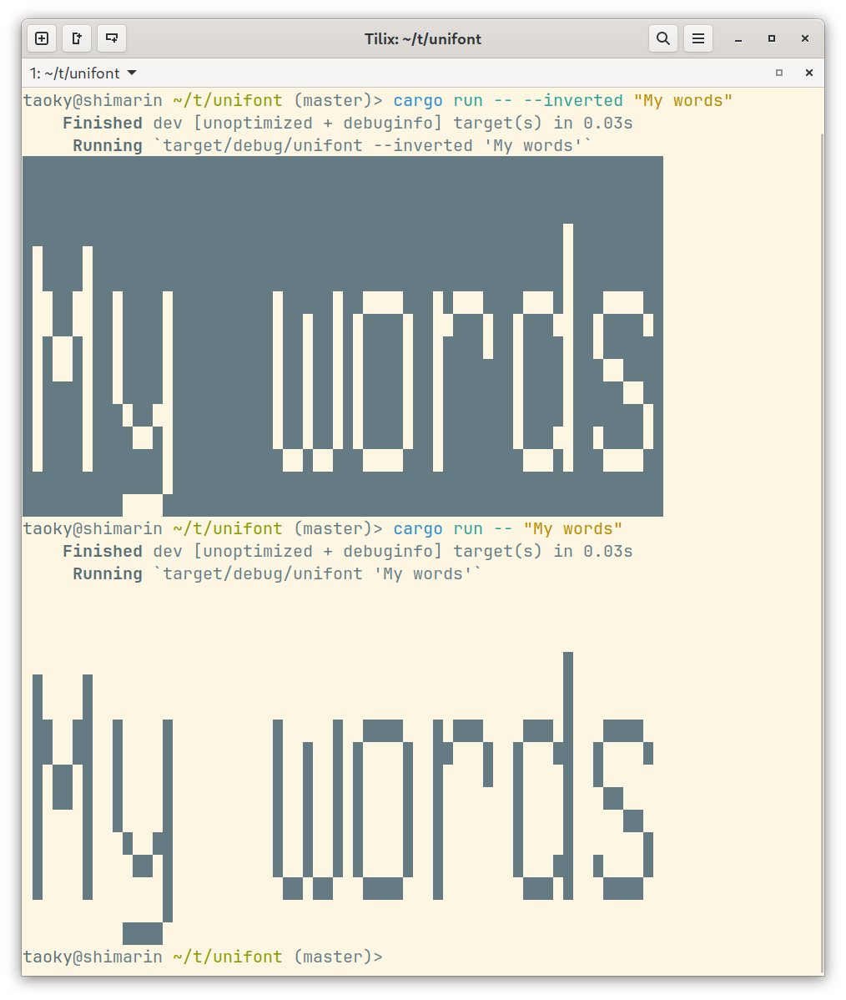
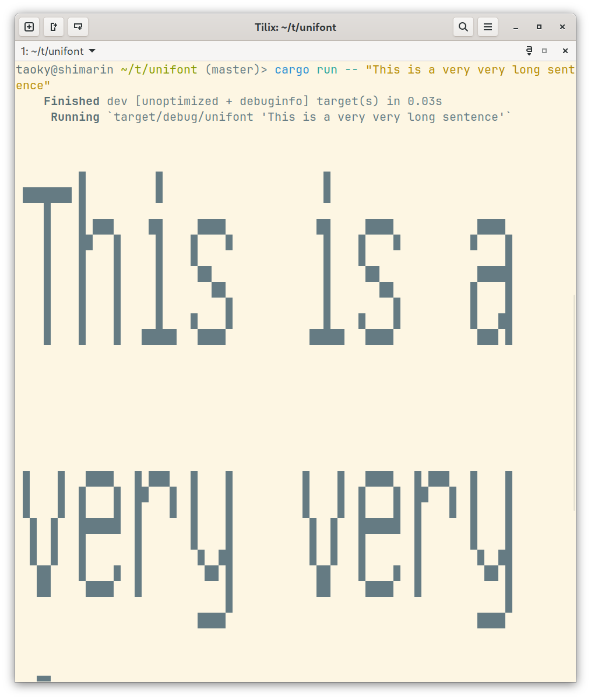
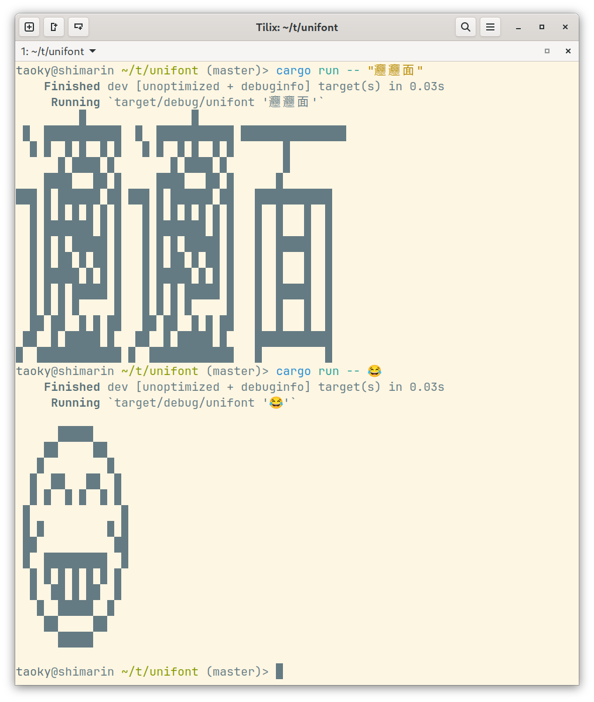

# unifont-show

Yet another toy project to show large Unicode text in terminal. Not all languages work properly, as [GNU Unifont](https://en.wikipedia.org/wiki/GNU_Unifont) is usually a "last resort" when rendering text.

## Features

- RIIR
  - Rust's built-in string is always valid UTF-8. This is consistent and convenient.
- Fit your console size (columns)
- Support inverted color

## Usage

Put unifont to same directory as executable's cwd.

```bash
# Change to a GNU mirror near to you if it's slow.
wget https://mirror.us-midwest-1.nexcess.net/gnu/unifont/unifont-15.1.02/unifont_all-15.1.02.hex.gz
gunzip unifont_all-15.1.02.hex.gz
```

And then

```bash
cargo run -- "My words"
```

Or, if you like dark background:

```bash
cargo run -- --inverted "My words"
```

## Examples



*Inverted color example*



*Fit terminal width*



*Rare characters and emoji*

## Notes

I have tried to use [phf_codegen](https://docs.rs/phf_codegen/latest/phf_codegen/) crate to include unifont as a map at compile time, but then it eats a lot of memory and takes a long time to compile. Sounds not like a very good idea.